# CoSMA-Editor Documentation
The **Co**llaborative **S**ocial **M**edia **A**ccount **Editor** (CoSMA-Editor) is a tool for merging and curating lists containing social media accounts and associated metadata.
This software is intended to facilitate a community data trustee that is adaptable to different use cases.
This document provides an introduction for users wanting to retrieve and contribute data.
For instructions on reviewing contributed data check the [management documentation](management.md)

# View and Curate Data

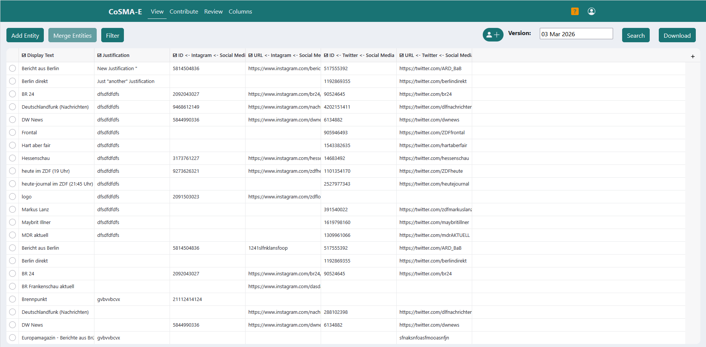

The **View** section of CoSMA-Editor will be used to explain the key concepts of the software.
The section consist mainly of a table.
Each row represents an *entity*, i.e., an actor controlling one or more social media accounts.
## Columns
The columns of the table contain data related to *entities*.
By default two columns are shown: *display text* and *justification*.
*Display text* is the name of the entity.
If there is no name for the entity, the value of a column may be used instead.
By hovering over a display text you can see the source of the display text.
When you click on the  that appears when hovering over a display text, you will see all values for that entity.
*Justification* contains reasoning for why an entity is allowed to be in the database.
A double click on a justification will open the justification history of that entity.
You can show data from additional columns by clicking on the plus symbol in the upper right corner of the table.
This will open the *Colum Explorer*
### The Column Explorer
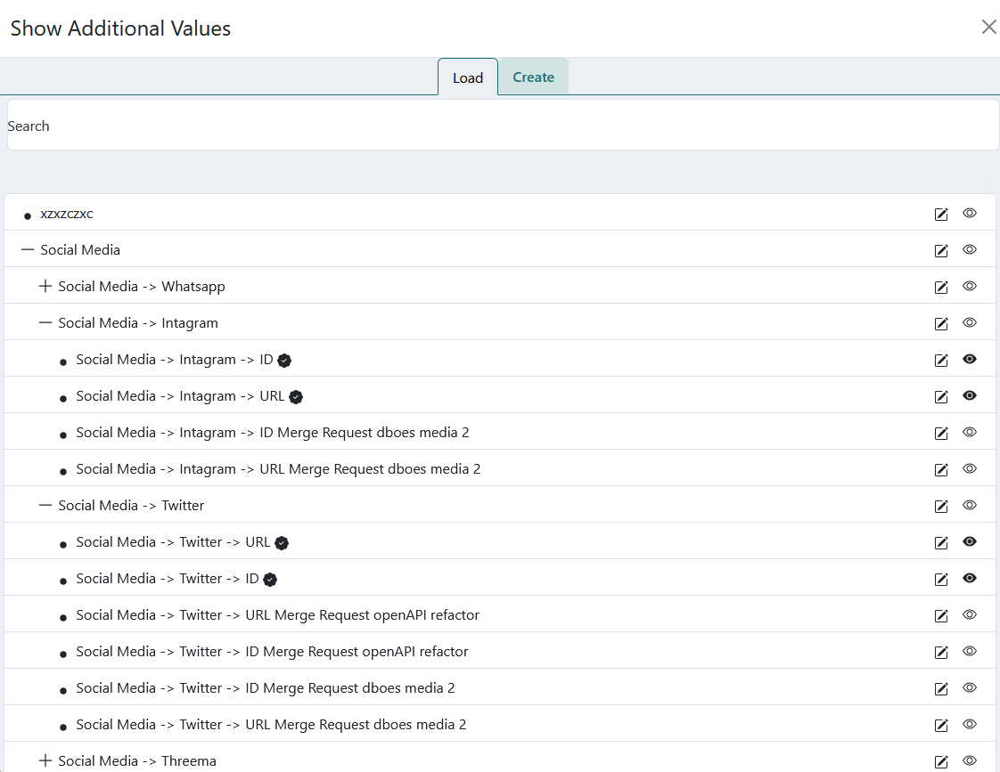

You can explore the existing columns in the column explorer.
Either by manually expanding and collapsing the hierarchy or by searching for the name of a column.
Some of the columns are marked with a checkmark.
They are curated columns, managed by the providers of the software.
All other columns are user columns.
They belong to individual users who are responsible for the content.
### Creating Columns
You can create a new column by selecting the **Create** tab of the column explorer.

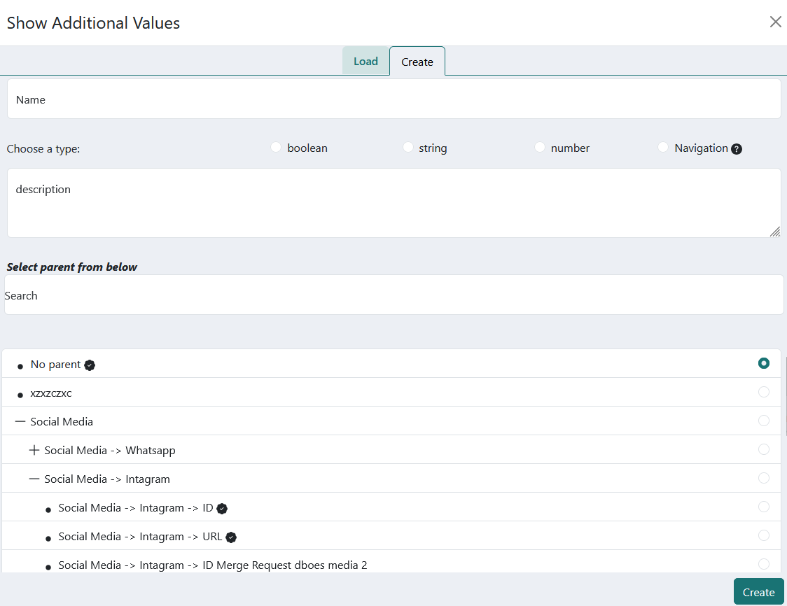

When creating you have to provide the following information
* A *name* for the column
* The type of the data in the column.
  * **String** any text
  * **Number** only number values are allowed
  * **Boolean** only the truth values `true` and `false` are allowed.
  * **Navigation** columns do not contain any data.
  They are only used to structure the column hierarchy.
* An optional *description* of the contents of the column.
* The position in the column hierarchy.
### Editing Columns
To change the position of a column in the hierarchy you can drag the column and drop it on the desired parent in the hierarchy.
For other changes to a column you can click on the edit button () in the column explorer.
It is not possible to change the data type of a column.

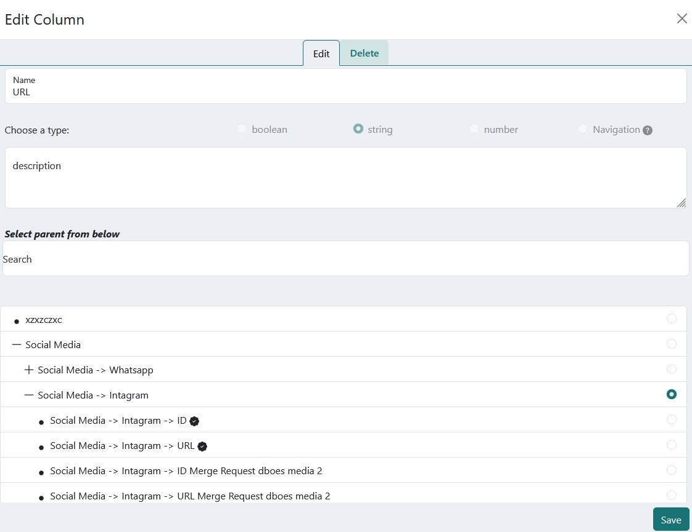

### Deleting Columns
To delete a column select the **Delete** tab from the column edit dialog.
There you will have two options, *disable* and *purge*.
For each you have to write the name of the desired operation in the correct text field.
* *disable* will keep the column and all its data accessible from the history but will exclude it from the current version of the data trustee.
* *purge* will remove the column and all its data from the history.
The data is not recoverable.

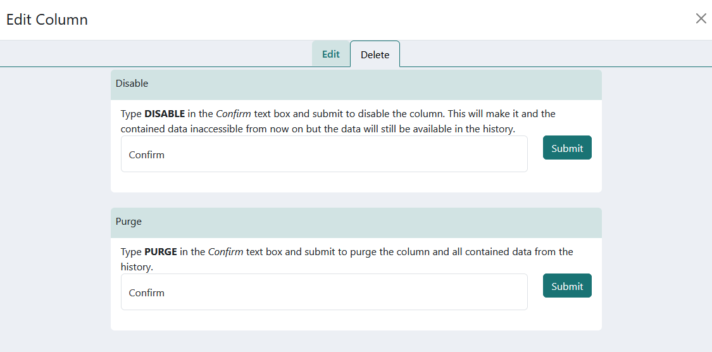

## Search
You can search the currently displayed data by clicking the **Search** button.

## Edit Sessions
To manage co-authorship the concept of edit session is used.
Every edit you make is tied to an edit session instead of your account.
An edit session contains multiple authors.
Each author is either a user of *CoSMA-Editor* or represented by an [ORCID](https://orcid.org/)
You can manage edit sessions by clicking on the button shown as () or ().
### Current Edit Session
From the **Current** tab you can add or remove authors from the active edit session.
**Important**: when you change the composition of an edit session the authorship of all past edits made with that session will change.

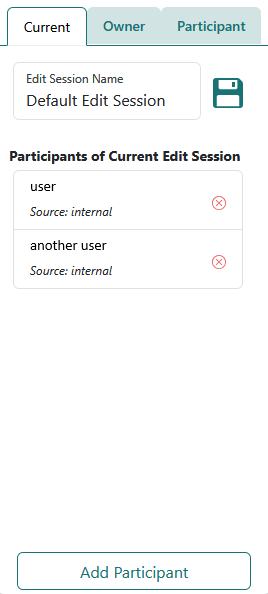

#### Adding Participants
When you click on **Add Participant**, a form field appears.
There you can either search for other accounts of the platform or copy and paste an *ORCID*.
After clicking on an entry the co-author will be added to the edit session.

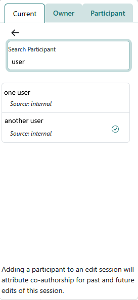

#### Remove participants
When clicking on  next to an edit session participant, a disclaimer on the consequences of participant removal will be shown.
The warning will inform, you that removal will delete all author attribution from the participant for past and future edits made using that edit session.
After confirming the disclaimer, the participant will be removed from the edit session.
### Owned Edit Sessions
The **Owner** tab lets you select an edit session as active and allows you to create new edit session.
An edit session is selected by clicking on its name.
To create a new edit session type the name in the text field and click on **New Edit Session**

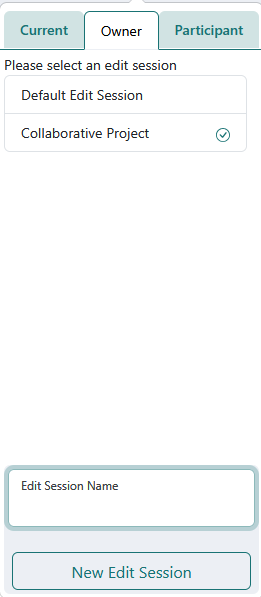

### Other Edit Sessions
From the **Participant** tab you can see edit sessions owned by others that you participate in.
By clicking on  you can remove yourself from an edit session.

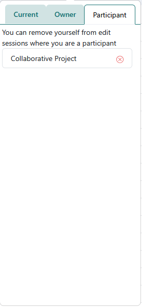

## Filter Data
By clicking the **Filter** button you open the filter editor.

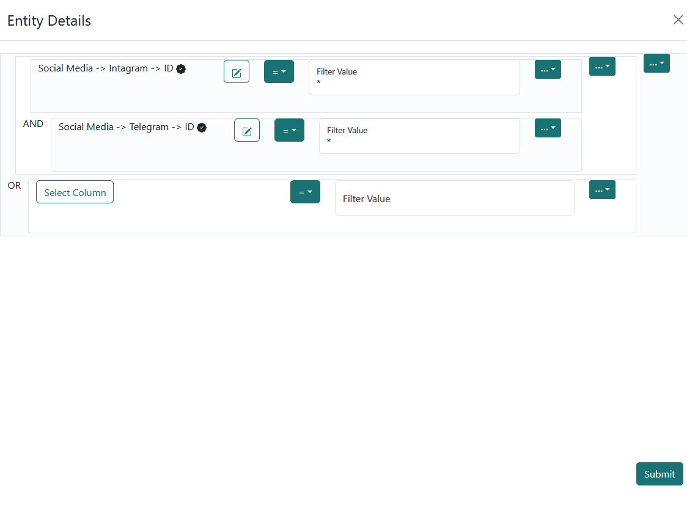

### Searching a Filter Column
You can select a column to filter values on by searching its name.
### Selecting a Predicate
You can change whether to filter on equality or inequality from the drop down menu next to the column search.
### Setting a Filter Value
Enter the desired filter value for your selected column in the text field.
The filter values support wildcards represented as `*`.
### Combine or Remove Filters
Multiple filters can be combined by selecting **and** or **or** from the drop down menu at the end of the filter.
From the same menu filters can be deleted.

## Download Data
The currently displayed data can be saved as a CSV-file by clicking the **Download** button.

## Access History
To access the data of the trustee at a date in the past select the date from the date picker next to the version label.

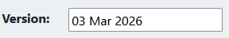

# Data Upload
To upload new data use the **Contribute** section of *CoSMA-Editor*
## Create Contribution Upload
To create a new contribution, click on the **Upload CSV** button.
A form will appear.

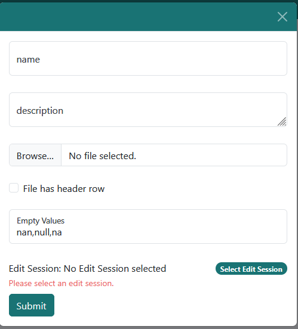

Please fill in the following information:
* a name for the upload
* an optional description
* select the file containing the desired data from the file system on your machine.
* indicate, whether the the file has a header row. This helps in the next step.
* select empty values. This is a comma separated list of values that should be ignored during the upload.
* select an edit session. All data used from your upload will be attributed to the selected edit session.

Your data will be uploaded after clicking the **Submit** button.
## Column Assignment
After uploading data, you will be forwarded to the *column assignment* step.

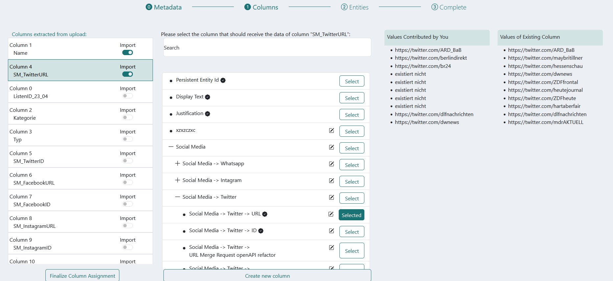

The UI for column assignment consists of three columns.
1. The column names extracted from the uploaded CSV.
2. The columns present in the database.
3. A data preview.

To assign data from a column of the CSV file to a column in the database do the following:
1. Select the column from the left part in the UI.
2. Select a column present in the database from the column explorer.
3. Take a quick glance at the data preview to confirm that the assignment makes sense.

When you have assigned all columns click on **Finalize Column Assignment**
### Special columns
There are three special columns you can select when assigning columns.
* **Display Text** is the natural name of an entity.
This will be used, among other data, to match the rows of your uploaded CSV file to entities in the database.
* A **Justification** is required for each entity added to the database.
If there is a justification column in your upload it can be assigned here.
* **Persistent Id** If your upload is a modification of data downloaded from *CoSMA-Editor*,
selecting this column will simplify the entity matching step.

## Entity Matching
After assigning columns it is necessary to match the rows of your upload to entities in the database.
You will see a list of entities.
Click on the first entity to start the matching process.

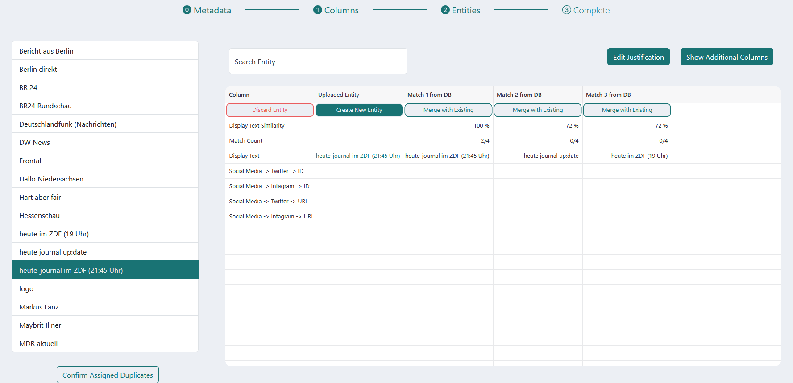

### Deciding on Entity Matches
In the main part of the *entity matching* view you will see a table.
In the first column you will see descriptions of the values of that row:
* The row labeled **Display Text Similarity** will show the similarity between the display texts of a row from your file and an entity from the database.
* **Match Count** contains the number of columns that are an exact match between a row from your file and an entity from the database.
* **Display Text**  is the *display text* of the entity.
* All remaining rows are columns from the database and contain the corresponding values related to the entity in the column.

The second column will represent a row from your upload.
All other columns will possible matches found in the database.
The first row contains a set of buttons.
They represent your options.
* **Discard** will ignore the shown entity
* **Create New Entity** will add a new entity to the database, when the *entity matching* step is completed.
If you have not assigned a *justification* column from your upload you will be prompted for details on why the entity should be added.
* **Merge with Existing** will indicate that all data of the corresponding row will be treated as belonging to the entity represented by the cells below the button.
* All other rows show data as indicated by the first column.

When you have decided on all entities click on **Confirm Assigned Duplicates**.
This will result in a *merge request* for each column you assigned. (See below for more details)
### Additional Matching Details
It is possible to display additional information that may help you in deciding on entity matches.
Click on **Show Additional Columns** to select a column.
The data of that column will be shown in the matching view.
### View Additional entities
It is possible, that you know there should be an entity in the database that matches the row from your upload but the entity is not shown in the matching view.
In that case, search for the entity by entering its details in the search field.

# Review
The **Review** section of the app contains merge requests created by or assigned to you.
As a normal user you will mostly create merge requests as part of the upload process.
## Comments
Here you can exchange messages with the person the merge request is assigned to.
## Resolve
If a merge request is assigned to you, go through each conflict and make a decision.
There are three possible resolutions
* **Keep Existing Value** will discard the proposed change from the merge request.
* **Use New Value** will replace the existing data with the proposed change.
* **Use Replacement Value** allows you to enter a value for the entity that is neither the original data nor the proposed change.
This may be helpful, when the proposed is nearly correct but has a typo.

When all conflicts are resolved, click on **Apply Resolutions to Destination**

# Column Ownership
When you create a new column it belongs to your account.
This means the following:
* You can change its name, description and position in the column hierarchy.
* Merge requests for that column are assigned to you.

You can transfer the ownership to a different user.
In order to do so, you need to activate the column in the **View** section of *CoSMA-Editor*.
Then click on the small triangle that appears when you hover over the header of the column.
Select **Change Owner**.
In the appearing dialog search for the user you want to transfer ownership to.
Click on the correct username.
Afterwards the other user needs to accept the ownership request from the **Columns** section.
If you want to withdraw the ownership request, you can also do so from the **Column** section.
